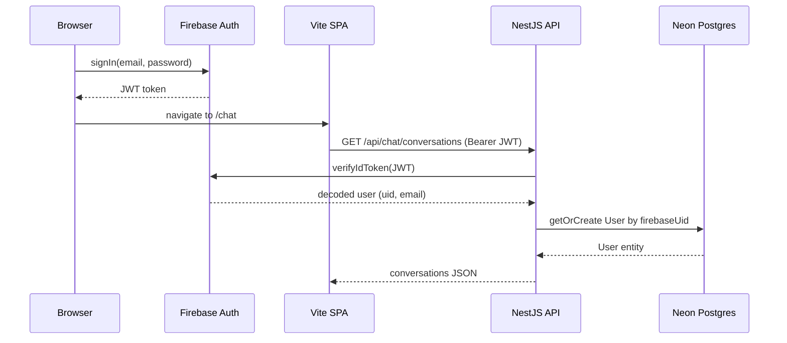
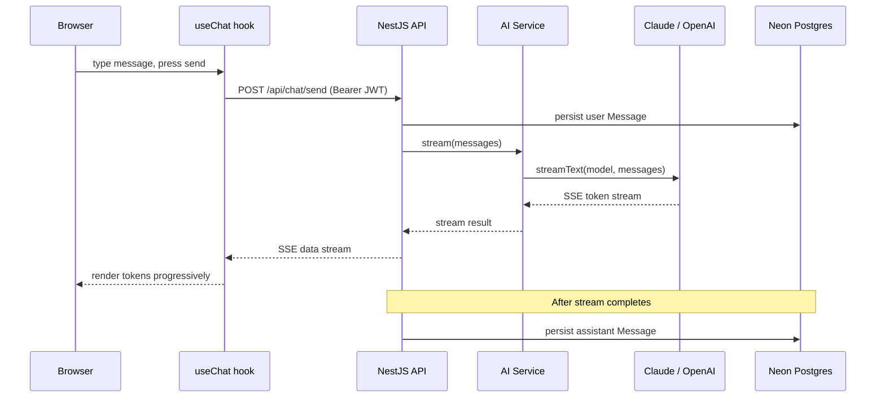
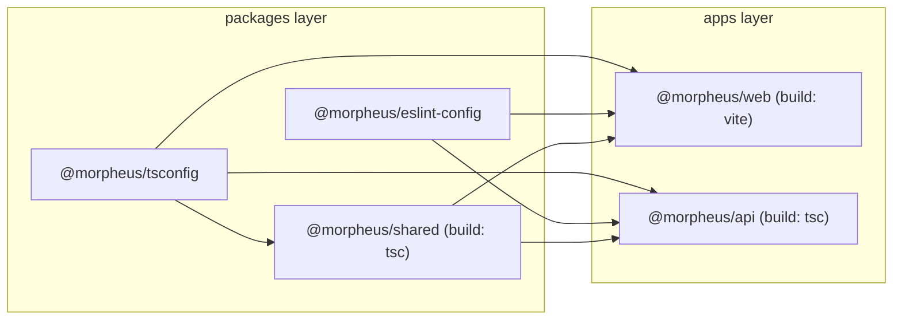

# Morpheus Starter Pack — Implementation Plan

## Staff-Engineer Audit Notes (applied below)

1. **Dual validation eliminated.** class-validator + class-transformer DTOs removed. Zod is the single validation system across the entire monorepo. A `ZodValidationPipe` replaces NestJS DTO classes.
2. **YAGNI cuts.** Removed: full User CRUD (list/delete), PaginatedResponse, settings page, user model preference, seo-head + react-helmet-async, avatar component, Axiom browser SDK. Users are created via auth-guard sync, not REST. Model set via env var, not user preference.
3. **MikroORM RequestContext promoted from risk to plan.** `MikroOrmModule.forMiddleware()` explicitly registered in `app.module.ts` to prevent identity map leaks across requests on serverless.
4. **User sync flow specified.** Firebase auth guard calls `UsersService.getOrCreate()` — the only user-creation path. No separate POST endpoint.
5. **Logging interceptor removed.** `nestjs-pino` already logs method, URL, status, duration, requestId per request. Business-context logs belong in services.

**Net impact:** 8 fewer files, one validation system instead of two, clearer user-creation flow, explicit RequestContext configuration, specified message persistence semantics.

---

## 1. Summary

Build a public GitHub repository `morpheus-starter` containing: (A) a fully baked agent operating system — skills, agents, docs, rules, and evaluation criteria for autonomous Cursor-based development; and (B) application skeleton templates that an `init-project` skill hydrates into a working full-stack app with Turborepo monorepo, NestJS REST API with MikroORM, Vite/React/Tailwind frontend, Firebase Auth, Vercel AI SDK streaming chat, Neon Postgres, Pino+Axiom observability, and auto-deploy to Vercel on git push.

---

## 2. Design Decisions

**Monorepo structure (Turborepo + pnpm workspaces):**

- `apps/web` (Vite SPA) and `apps/api` (NestJS) as two Vercel deploy targets
- `packages/shared` for API contract Zod schemas + inferred types — pre-built to JS for NestJS consumption
- `packages/tsconfig` for shared TypeScript base configs (JSON only, no build step)
- `packages/eslint-config` for shared ESLint flat config
- MikroORM entities stay INSIDE `apps/api/src/` — backend-only, avoids cross-package compilation complexity

**NestJS + Turborepo compilation chain:**

- `packages/shared` has a `build` script (tsc) that compiles TS to JS
- `turbo.json` declares `build` with `dependsOn: ["^build"]` — packages build before consuming apps
- NestJS compiles via `tsc` (default), consuming pre-built JS from shared

**Validation: Zod as the single system (Golden Principle #2):**

- `packages/shared` owns all Zod schemas (env, user, chat). Types inferred and co-exported via `z.infer`
- API uses a global `ZodValidationPipe` — takes schema, validates `request.body`, throws `BadRequestException` with structured errors on failure
- No class-validator, no class-transformer, no NestJS DTO classes

**Logging: Pino + Axiom:**

- API: `nestjs-pino` with `pino-http` — JSON in production (stdout, captured by Vercel), pretty-print in dev, request context auto-logged (requestId, method, url, status, duration), authorization headers redacted
- Web: `pino/browser` wrapper — pretty console in dev, JSON in production (stdout only, no client drain in V1)
- Axiom: Vercel log drain for API logs (optional, requires Vercel Pro). Free tier: 500GB/mo, 30-day retention. Documented as optional setup, not wired by default
- Conventions in `docs/LOGGING.md`: log boundaries and failures, never log secrets/tokens/full payloads

**Testing: Vitest everywhere:**

- Vitest for both apps (one runner, one config pattern)
- NestJS + Vitest: `unplugin-swc` plugin for decorator/metadata support
- API tests: `@nestjs/testing` Test.createTestingModule() + Vitest
- Web tests: `@testing-library/react` + jsdom
- Separate-agent workflow: implement first, tests in independent pass via `generate-test` skill

**Development harness:**

- `pnpm dev` — Turborepo starts web (Vite, :5173) + api (NestJS, :3000) in parallel
- Vite dev server proxies `/api/` to `http://localhost:3000` (no CORS in dev)
- `pnpm build` — builds all packages + apps
- `pnpm lint` — ESLint across monorepo
- `pnpm type-check` — tsc --noEmit across monorepo
- `pnpm check` = lint + type-check
- `pnpm validate` = check + tests
- `pnpm test` — Vitest across all apps (can filter: `--filter=@morpheus/api`)
- `pnpm migrate:create` — MikroORM migration creation
- `pnpm migrate:up` — MikroORM migration execution

**Agent operating system layout (`.agents/` as source of truth):**

- `.agents/` is the canonical home for all agent definitions, skills, and rules. Every `.md` file that defines agent behavior lives here.
- `.agents/skills/` — all skill workflows (SKILL.md files + reference subdirectories)
- `.agents/rules/` — always-on agent rules (`.mdc` files)
- `.agents/agents/` — agent role definitions
- `.agents/tmp/` — scratch space for agent outputs (e.g., PR descriptions)
- `.cursor/skills/` and `.cursor/rules/` are **symlinks** pointing to their `.agents/` counterparts (`../.agents/skills/` and `../.agents/rules/` respectively). This lets Cursor discover skills and rules via its standard `.cursor/` convention while keeping the source of truth in `.agents/`.
- Rationale: `.cursor/` is IDE-specific plumbing. Separating the canonical definitions into `.agents/` makes it explicit that these files are project artifacts — version-controlled, portable, and not tied to a particular IDE's directory convention.

**Firebase Auth flow:**

- Client: Firebase JS SDK, `signInWithPopup` / `signInWithEmailAndPassword`, user gets JWT
- API: NestJS `FirebaseAuthGuard` extracts Bearer token, verifies via Firebase Admin SDK `verifyIdToken()`, JWKS cached in-memory for function lifetime
- **User sync:** auth guard calls `UsersService.getOrCreate(firebaseUid, email, displayName)` after JWT verification. This is the **only** user-creation path. If no Postgres row exists for that `firebaseUid`, one is created.
- `@CurrentUser()` param decorator extracts the User entity from request

**AI streaming flow:**

- Vercel AI SDK provider registry: anthropic + openai configured from env vars
- `POST /api/chat/send` accepts `{ conversationId?, content }`, validated via Zod
- Controller calls `AiService.stream()` which uses `streamText()`, returns `toDataStreamResponse()` (SSE)
- Frontend `useChat()` hook from `@ai-sdk/react` consumes SSE
- User message persisted to Postgres **before** streaming starts; assistant message persisted **after** stream completes
- Model configured via `DEFAULT_AI_MODEL` env var (e.g. `anthropic:claude-sonnet-4-20250514`)

**Entity model (MikroORM, abstract base):**

- `BaseEntity` (abstract): `id` (UUID, gen_random_uuid()), `createdAt` (auto-set onCreate), `updatedAt` (auto-set onCreate + onUpdate)
- `User`: extends BaseEntity + `firebaseUid` (unique), `email` (unique), `displayName` (nullable)
- `Conversation`: extends BaseEntity + `title` (nullable, defaults to first message truncated), `@ManyToOne User`
- `Message`: extends BaseEntity + `role` (enum: user|assistant), `content` (text), `@ManyToOne Conversation`

---

## 3. File-by-File Changes

All files are NEW (greenfield repo).

### Root — monorepo scaffolding

- `package.json` — root workspace scripts: dev, build, lint, type-check, check (lint+type-check), validate (check+test), test, migrate:create, migrate:up
- `pnpm-workspace.yaml` — declares `apps/*` and `packages/*`
- `turbo.json` — task pipeline: build (dependsOn: ^build, cached, outputs: dist/), dev (persistent, no cache), lint (cached), type-check (cached), test (cached)
- `.gitignore` — node_modules, dist, .env, .turbo, coverage, .mikro-orm/
- `.prettierrc` — singleQuote, trailingComma: all, semi: true, printWidth: 100
- `.env.example` — all required env vars with comments
- `README.md` — "Fork, run init-project, ship" quick start guide
- `AGENTS.md` — pre-init placeholder: explains the starter pack, points to `init-project` skill, lists available skills/agents
- `ARCHITECTURE.md` — pre-init placeholder: explains this gets generated by init-project

### packages/tsconfig

- `base.json` — strict TS: strict, noUncheckedIndexedAccess, esModuleInterop, skipLibCheck, target ES2022
- `react.json` — extends base: jsx react-jsx, lib DOM+DOM.Iterable+ES2022
- `nestjs.json` — extends base: experimentalDecorators, emitDecoratorMetadata, declaration, outDir dist
- `package.json` — name: @morpheus/tsconfig

### packages/eslint-config

- `base.js` — ESLint flat config: typescript-eslint, no-unused-vars, prefer-const, named-exports-only
- `react.js` — extends base: react-hooks, jsx-a11y
- `nestjs.js` — extends base: NestJS-specific rules
- `package.json` — name: @morpheus/eslint-config

### packages/shared — Zod schemas + inferred types

- `src/index.ts` — barrel export of all schemas and types
- `src/schemas/env.ts` — Zod schema: NEON_DATABASE_URL, FIREBASE_PROJECT_ID, FIREBASE_PRIVATE_KEY, FIREBASE_CLIENT_EMAIL, ANTHROPIC_API_KEY (optional), OPENAI_API_KEY (optional), DEFAULT_AI_MODEL, AXIOM_TOKEN (optional), AXIOM_DATASET (optional), NODE_ENV
- `src/schemas/user.ts` — CreateUserSchema, UpdateUserSchema, UserResponseSchema + `z.infer` types co-exported
- `src/schemas/chat.ts` — SendMessageSchema, ConversationResponseSchema, MessageResponseSchema + `z.infer` types co-exported
- `src/schemas/api.ts` — `ApiResponse<T>`, `ApiError` generic TypeScript types
- `tsconfig.json` — extends @morpheus/tsconfig/base.json (no decorators needed)
- `package.json` — name: @morpheus/shared, build: tsc, exports: ./dist/index.js

### apps/web — Vite + React + Tailwind + shadcn frontend

**Config:**

- `package.json` — name: @morpheus/web. deps: react, react-dom, react-router, @ai-sdk/react, firebase, pino, tailwindcss, @tailwindcss/vite, @radix-ui/react-slot, class-variance-authority, clsx, tailwind-merge. devDeps: vitest, @testing-library/react, @testing-library/jest-dom, jsdom, typescript
- `vite.config.ts` — @tailwindcss/vite, proxy `/api` to `http://localhost:3000`, path alias `@/` to `src/`
- `vitest.config.ts` — jsdom environment, setup file `src/test/setup.ts`, path aliases
- `tsconfig.json` — extends @morpheus/tsconfig/react.json, paths `@/*` to `src/*`
- `index.html` — SPA entry, font preloads (Inter from Google Fonts)

**App shell:**

- `src/main.tsx` — ReactDOM.createRoot, import globals.css
- `src/app/router.tsx` — React Router: `/` (home), `/chat` (protected), `/login`
- `src/app/providers.tsx` — AuthProvider wrapping children
- `src/app/layout.tsx` — nav bar (logo, chat link, user menu), `<Outlet />`, minimal footer

**Pages:**

- `src/pages/home.tsx` — landing skeleton: hero, CTA to /chat or /login
- `src/pages/chat.tsx` — renders `<ProtectedRoute><ChatPage /></ProtectedRoute>`
- `src/pages/login.tsx` — Firebase email/password + Google sign-in buttons

**Features — chat:**

- `src/features/chat/chat-page.tsx` — conversation sidebar + active chat panel
- `src/features/chat/chat-message.tsx` — message bubble, user vs assistant styling
- `src/features/chat/chat-input.tsx` — text input, send button, streaming indicator
- `src/features/chat/use-chat-stream.ts` — wraps `@ai-sdk/react` `useChat()`, injects Firebase JWT via `headers` option

**Features — auth:**

- `src/features/auth/auth-provider.tsx` — Firebase `onAuthStateChanged` context provider
- `src/features/auth/use-auth.ts` — hook: `user`, `loading`, `signIn()`, `signOut()`, `getToken()`
- `src/features/auth/protected-route.tsx` — redirects to `/login` if not authenticated

**Components:**

- `src/components/ui/button.tsx` — shadcn-style (cva + Radix Slot)
- `src/components/ui/input.tsx` — shadcn-style input
- `src/components/ui/card.tsx` — shadcn-style card

**Lib:**

- `src/lib/firebase.ts` — Firebase app init + auth instance from env-driven config
- `src/lib/api-client.ts` — typed fetch wrapper: injects Bearer token, parses ApiResponse/ApiError
- `src/lib/logger.ts` — pino/browser: pretty in dev, JSON in production
- `src/lib/cn.ts` — clsx + tailwind-merge

**Styles:**

- `src/styles/globals.css` — Tailwind v4 @theme: CSS variables for colors, spacing, fonts (Inter for all tiers in V1, customizable via init)

**Test:**

- `src/test/setup.ts` — Vitest setup: `@testing-library/jest-dom` matchers, cleanup afterEach

### apps/api — NestJS + MikroORM

**Config:**

- `package.json` — name: @morpheus/api. deps: @nestjs/core, @nestjs/common, @nestjs/platform-express, @mikro-orm/core, @mikro-orm/nestjs, @mikro-orm/postgresql, @mikro-orm/migrations, nestjs-pino, pino-http, pino-pretty (dev), firebase-admin, ai, @ai-sdk/anthropic, @ai-sdk/openai, zod, reflect-metadata. devDeps: vitest, unplugin-swc, @swc/core, @nestjs/testing, @morpheus/shared
- `vitest.config.ts` — unplugin-swc plugin (decorator support), path aliases, globals
- `tsconfig.json` — extends @morpheus/tsconfig/nestjs.json, paths
- `tsconfig.build.json` — extends tsconfig.json, excludes test files, outDir dist/
- `vercel.json` — NestJS as single serverless function, route all `/api/`
- `mikro-orm.config.ts` — root-level config for MikroORM CLI (migrations, seeding)

**Bootstrap:**

- `src/main.ts` — NestJS bootstrap: create app with `bufferLogs: true`, global prefix `/api`, CORS (origin from env), attach Pino logger, register global `ZodValidationPipe`, validate env vars via Zod at boot (fail fast with clear error), listen on `PORT || 3000`
- `src/app.module.ts` — root module imports: `MikroOrmModule.forRoot(config)`, `MikroOrmModule.forMiddleware()` (RequestContext per request), `LoggerModule.forRoot({ pinoHttp config })`, UsersModule, ChatModule, AiModule, HealthModule

**Common (cross-cutting):**

- `src/common/entities/base.entity.ts` — abstract class: `@PrimaryKey({ type: 'uuid', defaultRaw: "gen_random_uuid()" }) id`, `@Property({ onCreate: () => new Date() }) createdAt`, `@Property({ onCreate: () => new Date(), onUpdate: () => new Date() }) updatedAt`
- `src/common/guards/firebase-auth.guard.ts` — `@Injectable() implements CanActivate`: extract Bearer from Authorization header, `admin.auth().verifyIdToken(token)`, call `UsersService.getOrCreate()` to sync user to Postgres, attach User entity to `request.user`. Uses `ModuleRef` to resolve UsersService (avoids circular dependency).
- `src/common/decorators/current-user.decorator.ts` — `createParamDecorator` extracting `request.user` (User entity)
- `src/common/pipes/zod-validation.pipe.ts` — `@Injectable() implements PipeTransform`: constructor takes Zod schema, `transform()` calls `schema.safeParse(value)`, throws `BadRequestException` with formatted Zod issues on failure
- `src/common/filters/all-exceptions.filter.ts` — `@Catch() implements ExceptionFilter`: logs error via Pino, returns consistent `{ error, message, statusCode }` shape, never exposes stack traces in production

**Users module:**

- `src/users/users.module.ts` — registers User entity via `MikroOrmModule.forFeature([User])`, provides UsersService, UsersController. Exports UsersService (for auth guard).
- `src/users/users.controller.ts` — `GET /api/users/me` (current user profile), `PATCH /api/users/me` (update displayName). `@UseGuards(FirebaseAuthGuard)`.
- `src/users/users.service.ts` — `getOrCreate(firebaseUid, email, displayName)`: find by firebaseUid or create + flush. `findByFirebaseUid()`. `updateProfile(user, data)`: validate with UpdateUserSchema from @morpheus/shared, assign, flush.
- `src/users/entities/user.entity.ts` — `@Entity() class User extends BaseEntity`: `@Property({ unique: true }) firebaseUid`, `@Property({ unique: true }) email`, `@Property({ nullable: true }) displayName`

**Chat module:**

- `src/chat/chat.module.ts` — registers Conversation + Message entities, provides ChatService, ChatController. Imports AiModule.
- `src/chat/chat.controller.ts` — `POST /api/chat/send` (streaming SSE: validate body with SendMessageSchema, call chatService.sendMessage(), return SSE response), `GET /api/chat/conversations` (list user's conversations), `GET /api/chat/conversations/:id` (conversation with messages). `@UseGuards(FirebaseAuthGuard)`.
- `src/chat/chat.service.ts` — `sendMessage(user, { conversationId?, content })`: find or create Conversation (title defaults to truncated first message), persist user Message, call `aiService.stream(messages)`, on stream complete persist assistant Message, return stream. `getConversations(user)`. `getConversation(user, id)` with ownership check.
- `src/chat/entities/conversation.entity.ts` — `@Entity() class Conversation extends BaseEntity`: `@Property({ nullable: true }) title`, `@ManyToOne(() => User) user`, `@OneToMany(() => Message, m => m.conversation) messages`
- `src/chat/entities/message.entity.ts` — `@Entity() class Message extends BaseEntity`: `@Enum(() => MessageRole) role`, `@Property({ type: 'text' }) content`, `@ManyToOne(() => Conversation) conversation`

**AI module:**

- `src/ai/ai.module.ts` — provides + exports AiService
- `src/ai/ai.service.ts` — creates provider registry with `createProviderRegistry({ anthropic, openai })`. `stream(messages[])`: resolves model from `DEFAULT_AI_MODEL` env var via registry, calls `streamText({ model, messages })`, returns the stream result. `getModel()`: parses `provider:model-id` string from env.

**Health module:**

- `src/health/health.module.ts` — provides HealthController
- `src/health/health.controller.ts` — `GET /api/health` returns `{ status: 'ok', timestamp: new Date().toISOString() }`

**Config:**

- `src/config/env.schema.ts` — re-exports `EnvSchema` from @morpheus/shared, exports `validateEnv()` function that calls `schema.parse(process.env)` and returns typed config
- `src/config/mikro-orm.config.ts` — MikroORM config: `clientUrl` from env, `entities: ['./dist/**/*.entity.js']`, `entitiesTs: ['./src/**/*.entity.ts']`, `migrations: { path: './migrations' }`, `debug: process.env.NODE_ENV !== 'production'`

### docs/

- `STYLE_GUIDE.md` — generalized TypeScript/React conventions: strict TS, named exports only, kebab-case files, PascalCase components, camelCase functions/variables, imports order (third-party, @morpheus/ aliases, relative), React rules (no components inside components, functional only, hooks for logic, route files thin), Zod at all boundaries (single validation system), monorepo rule: import from @morpheus/shared for cross-app types
- `TESTING.md` — Vitest for both apps. API: unplugin-swc for decorator support, Test.createTestingModule() for unit tests, mock EntityManager at boundary. Web: Testing Library + jsdom, test behavior not implementation. Separate-agent workflow: implement then test in independent pass. Commands: `pnpm test`, `pnpm validate`. Colocated test files (`*.test.ts`). AAA pattern. Mock boundaries: Firebase Admin SDK, AI SDK streamText, MikroORM EntityManager. What to test: entity validation, auth guard logic, service CRUD, Zod schemas, route guards, chat streaming contract. What not to test: NestJS decorator wiring, static markup, Tailwind classes.
- `LOGGING.md` — Pino via nestjs-pino (API), pino/browser (web). JSON in production (stdout, captured by Vercel), pretty in dev (pino-pretty). Axiom as optional Vercel log drain (free tier: 500GB/mo, 30-day retention). Levels: debug (local troubleshooting), info (successful major ops), warn (degraded but recoverable), error (failed operation). Log: request boundaries, auth failures, DB errors, AI provider failures, env validation failures. Never log: secrets, tokens, full message content, stack traces more than once. Required context: requestId, userId, method, route, statusCode, duration, errorName. Redact: authorization headers.
- `UI_DESIGN.md` — template with sensible defaults: Inter for all text (display/body/UI), neutral gray palette with single brand accent (customizable via init-project). Mobile-first. CSS variables in globals.css. shadcn-style primitives only. No second component library.

### .agents/rules/

- `validation-workflow.mdc` — alwaysApply: true. After source/config/content changes: (1) run `pnpm check` in default sandbox, (2) if lint/type errors fix + rerun once, (3) if sandbox permission errors rerun with full permissions, (4) for tests run `pnpm validate`. Never skip.

### .agents/skills/ — 13 skills

- `init-project/SKILL.md` — **The crown jewel.** Phase 1: Ask 5-8 product questions via AskQuestion (product description, target user, AI chat needed?, AI provider choice, file uploads needed?, vector search needed?, GitHub+Vercel accounts confirmed, project name). Phase 2: Generate `AGENTS.md` from answers (product context, domain glossary, stack, golden principles). Phase 3: Generate `ARCHITECTURE.md` (routes, data flow, entity model). Phase 4: Optionally customize `UI_DESIGN.md` (brand colors/fonts). Phase 5: Shell commands — `gh repo create`, `pnpm install`, `vercel link`, `vercel env add` for each secret, run initial MikroORM migration, `git add . && git commit && git push`, `vercel deploy`. Phase 6: Handoff — print live URL, list available skills.
- `research-feature/SKILL.md` — 5-phase read-only workflow: understand (read AGENTS.md, ask questions), explore (read ARCHITECTURE.md + STYLE_GUIDE.md, scan code), simplify spec (challenge complexity), generate 2-3 options, delegate to staff-engineer Mode A.
- `research-feature/references/evaluation-criteria.md` — rubric: simplicity, YAGNI, spec bugs, system design bugs, separation of concerns, performance.
- `plan-feature/SKILL.md` — draft plan (summary, design decisions, file-by-file, test strategy, risks), delegate to staff-engineer Mode B, present final plan.
- `build-plan/SKILL.md` — orient (read plan + relevant docs only), implement in dependency layers with parallel subagents (packages first, then api/web), validate (`pnpm check`), runtime verify (`pnpm dev` + browser tools), simplicity review via staff-engineer.
- `fix-bug/SKILL.md` — understand + reproduce in browser (`pnpm dev`), explore code paths, hypothesize 2-4 root causes with evidence, discriminating questions, delegate to bug-fixer-ninja, present recommendation.
- `fix-bug/references/fix-evaluation-criteria.md` — rubric: simplicity, maintainability, YAGNI, separation of concerns, performance, correctness.
- `generate-test/SKILL.md` — scope (interactive or plan-driven), delegate to tester subagent (independent, did not implement feature), run tests + triage (bug vs test fix), surface bugs without fixing.
- `generate-test/references/test-evaluation-criteria.md` — test quality rubric.
- `design/SKILL.md` — understand, explore existing patterns + UI_DESIGN.md, propose design or audit page (browser screenshots at desktop + mobile), delegate to staff-designer, present results.
- `design/references/design-evaluation-criteria.md` — design quality rubric.
- `add-logs/SKILL.md` — clarify location, use docs/LOGGING.md conventions, add nestjs-pino or pino/browser logger calls, report what was added.
- `create-pr-description/SKILL.md` — gather git evidence (branch, log, diff), read conversation for intent, draft PR description (description + overview + changes), write to .agents/tmp/.
- `add-vector-store/SKILL.md` — install @turbopuffer/client, create VectorService in apps/api, add embedding generation via AI SDK `embedMany()`, add upsert/query endpoints, add Turbopuffer env vars to schema, update ARCHITECTURE.md.
- `add-blob-storage/SKILL.md` — install @vercel/blob, create UploadService in apps/api, add upload endpoint with auth, add File entity (extends BaseEntity), add BLOB_READ_WRITE_TOKEN to env schema, update ARCHITECTURE.md.

### .agents/agents/ — 3 agent definitions

- `staff-engineer.md` — generalized: staff engineer review specialist. Mode A (evaluate 2-3 options against rubric), Mode B (audit + edit plan for simplicity, YAGNI, system design bugs). References AGENTS.md principles and evaluation criteria.
- `bug-fixer-ninja.md` — generalized: bug diagnosis specialist. Validate hypotheses against codebase evidence, propose targeted fixes, score against rubric (simplicity, maintainability, YAGNI, separation, performance, correctness), recommend simplest correct solution.
- `staff-designer.md` — generalized: UI design reviewer. Reviews against docs/UI_DESIGN.md. Mode A (review existing page with browser screenshots), Mode B (review design proposal), Mode C (review implemented feature).

### .cursor/ — IDE symlinks

- `.cursor/skills/` — **symlink** → `../.agents/skills/`. Created so Cursor discovers skills via its standard convention.
- `.cursor/rules/` — **symlink** → `../.agents/rules/`. Created so Cursor discovers rules via its standard convention.
- `.cursor/agents/` — **symlink** → `../.agents/agents/`. Created so Cursor discovers rules via its standard convention.

These are committed to git. The canonical files live in `.agents/`; `.cursor/` contains only symlinks.

---

## 4. Test Strategy

**P0 tests (written in separate agent pass via generate-test):**

API:

- `apps/api/src/common/guards/firebase-auth.guard.test.ts` — valid token passes, missing/expired/malformed token → 401, user sync (getOrCreate called)
- `apps/api/src/common/pipes/zod-validation.pipe.test.ts` — valid body passes, invalid body → 400 with structured Zod errors
- `apps/api/src/users/users.service.test.ts` — getOrCreate (new user), getOrCreate (existing user), updateProfile validation
- `apps/api/src/chat/chat.service.test.ts` — conversation creation, message persistence order (user before stream, assistant after), user ownership check
- `apps/api/src/ai/ai.service.test.ts` — provider registry resolves correct model, streamText called with correct params
- `apps/api/src/config/env.schema.test.ts` — missing required vars fail, valid vars pass, optional vars accepted
- `apps/api/src/health/health.controller.test.ts` — returns 200 with status

Web:

- `apps/web/src/features/auth/protected-route.test.tsx` — redirects to /login when unauthenticated, renders children when authenticated
- `apps/web/src/lib/api-client.test.ts` — injects auth token header, handles ApiError responses
- `apps/web/src/features/chat/chat-input.test.tsx` — submits on enter, disables during streaming

Shared:

- `packages/shared/src/schemas/user.test.ts` — CreateUserSchema + UpdateUserSchema validation
- `packages/shared/src/schemas/chat.test.ts` — SendMessageSchema validation

---

## 5. Risks and Follow-ups

**Must resolve during implementation:**

1. **Turborepo build chain.** packages/shared must build before apps/api consumes it. Verify `turbo.json` `dependsOn: ["^build"]` works with NestJS tsc. Spike this first.
2. **Vercel routing for two apps.** Decide: one Vercel project (monorepo) or two? If one, `vercel.json` at root must route `/api/*` to NestJS function and `/*` to Vite SPA. If two, document the relationship and env var duplication. Recommend: one Vercel project with root `vercel.json`.
3. **MikroORM RequestContext on serverless.** `MikroOrmModule.forMiddleware()` in app.module.ts ensures per-request identity map isolation. Verify this works correctly in Vercel's single-function model where the NestJS process persists across invocations.
4. **Firebase Admin SDK JWKS caching.** Verify in-memory cache persists within Vercel function lifetime but doesn't leak stale keys across invocations. Firebase Admin SDK handles this by default — validate with a test.
5. **Vercel AI SDK streamText + NestJS.** SSE from NestJS controller through Vercel function to client. Verify backpressure and client disconnection handling. May need `@nestjs/platform-express` raw response passthrough.
6. **Vite proxy (dev) vs Vercel rewrites (prod).** Two routing configs must stay in sync. Document both in ARCHITECTURE.md with a cross-reference.
7. **init-project template correctness.** Generated TypeScript must pass `pnpm check`. Template interpolation errors break the founder's first experience. Test templates with sample inputs.
8. **Auth guard circular dependency.** Guard calls `UsersService.getOrCreate()`. Use `ModuleRef.resolve()` to lazily resolve UsersService, avoiding circular module imports.

**Follow-ups (post-V1):**

- Settings page with AI model preference per user
- User avatar component
- SEO head management for public-facing pages
- Pagination for conversation list
- Dark mode
- Rate limiting middleware
- OpenTelemetry distributed tracing
- Axiom browser SDK for web error monitoring
- E2E tests with Playwright
- GitHub Actions CI/CD template
- Vercel preview deployments for PRs

---

## Data Flow Diagrams

### Authentication + User Sync



### Chat Streaming



### Monorepo Build Pipeline



---

## 6. Harness Engineering Principles

These principles (drawn from OpenAI's harness engineering practice and our own production experience) govern how every `.md` file in the starter pack is written. They are non-negotiable for the agent operating system to function.

**AGENTS.md is a table of contents, not an encyclopedia.**
Keep it under 120 lines. It provides a map with pointers to deeper docs. A monolithic instruction file crowds out the task, the code, and the relevant context. When everything is "important," nothing is.

**Progressive disclosure.**
Agents start at `AGENTS.md`, then read only the docs relevant to their current task. No skill or agent should need to read more than 2-3 docs to operate. Every doc states its scope in the first line.

**Repository knowledge is the system of record.**
Anything an agent cannot access in-context while running effectively does not exist. No Slack threads, no Google Docs, no tribal knowledge. Everything goes into versioned markdown.

**Enforce invariants mechanically, not through prose.**
Where possible, encode rules as lints, CI jobs, or validation commands rather than documentation-only. `pnpm check` is the mechanical enforcement; docs explain the *why*.

**Token-efficient docs: no duplication across files.**
Each fact lives in exactly one place. Other docs reference it with a relative link. If two files contain the same information, one of them is wrong (or will be soon).

**Skill files are instructions, not explanations.**
Skills tell the agent what to do, in what order. They do not explain why the project exists or what the stack is — that is in AGENTS.md and ARCHITECTURE.md. Skills reference those docs by path.

**Agent definitions are role cards, not instruction manuals.**
Agent `.md` files define persona, operating mode, and output format. They point to evaluation criteria and project principles by path.

**Evaluation criteria are rubrics, not checklists.**
Each criterion has a one-sentence "what to look for." Agents score against the rubric, they do not mechanically check boxes.

---

## 7. Appendix — Complete Markdown File Contents

Every `.md` file below is written to its final form. When implementing, copy the content verbatim. Where `{PLACEHOLDER}` appears, the `init-project` skill fills it from founder answers.

---

### 7.1 AGENTS.md (pre-init placeholder)

```markdown
# AGENTS.md

Entry point for agents. Read this first, then drill into docs relevant to your task.

## 1) Product Context

This is an uninitialized Forge starter pack. Run the `init-project` skill to
configure it for your product.

After init, this section will contain: product description, target users, domain
glossary, and editorial positioning.

## 2) Repository Structure

Turborepo monorepo:

apps/web          Vite + React + Tailwind + shadcn SPA
apps/api          NestJS REST API + MikroORM + Vercel AI SDK
packages/shared   Zod schemas + inferred TypeScript types
packages/tsconfig Shared TypeScript base configs
packages/eslint-config Shared ESLint flat configs
docs/             Style guide, testing, logging, UI design
.agents/skills/   Agent skills (workflows) — source of truth
.agents/rules/    Always-on agent rules — source of truth
.agents/agents/   Agent role definitions
.cursor/skills/   → symlink to .agents/skills/
.cursor/rules/    → symlink to .agents/rules/
.cursor/agents/   → symlink to .agents/agents/

## 3) Quick Start

pnpm install
pnpm dev          # starts web (:5173) + api (:3000)
pnpm build
pnpm check        # lint + type-check
pnpm validate     # check + tests
pnpm test

## 4) Stack

- TypeScript (strict)
- React + Vite + Tailwind v4 + shadcn/ui
- NestJS + MikroORM + Neon Postgres
- Firebase Auth
- Vercel AI SDK (Anthropic / OpenAI)
- Vitest
- Pino (structured logging)
- Vercel (deploy)

## 5) Golden Principles

1. One canonical pattern per concern. If two approaches exist, pick one.
2. Validate external boundaries with Zod. Every external input, env var, API
   payload. Zod is the single validation system — no class-validator.
3. Named exports only. No default exports.
4. Test behavior, not implementation. Separate-agent workflow: implement first,
   test in independent pass.
5. Logging is structured and sparse. Log boundaries and failures. Never log
   secrets, tokens, or full payloads.
6. YAGNI. Build what is needed now. No abstractions for hypothetical futures.
7. Simple over clever. Flat over nested. Explicit over implicit.

## 6) General Principles

- Small units: functions do one thing.
- Flat control flow: early returns, obvious happy path.
- DRY without over-engineering: eliminate real duplication, not hypothetical.
- Separation of concerns: controllers thin, services own logic, lib owns utilities.
- Never define React components inside other components.
- Feature-based folder structure: keep component + hooks + sub-components together.

## 7) Documentation Map (read order)

1. AGENTS.md (this file)
2. ARCHITECTURE.md
3. docs/STYLE_GUIDE.md
4. docs/TESTING.md (when writing tests)
5. docs/LOGGING.md (when adding logs)
6. docs/UI_DESIGN.md (when touching UI)

## 8) Preferred Agent Workflow

1. Read AGENTS.md
2. Read only the docs relevant to the task
3. Implement the smallest complete change
4. Run pnpm check (default sandbox first; full permissions only on EPERM)
5. If implementation is done, run a separate test-writing pass
6. Run pnpm validate when tests are in scope
7. If conventions changed, update docs

## 9) Available Skills

| Skill | Trigger | Purpose |
|-------|---------|---------|
| init-project | /init-project | Conversational setup wizard |
| research-feature | /research-feature | Research + simplify + options + staff review |
| plan-feature | /plan-feature | Create implementation plan from research |
| build-plan | /build-plan | Implement plan with parallel subagents |
| fix-bug | /fix-bug | Diagnose bugs via hypotheses + ninja review |
| generate-test | /generate-test | Independent P0 test writing |
| design | /design | UI design / review + staff-designer |
| add-logs | /add-logs | Insert structured logging |
| create-pr-description | /create-pr | PR description from git diff |
| add-vector-store | /add-vector-store | Wire Turbopuffer vector search |
| add-blob-storage | /add-blob-storage | Wire Vercel Blob file storage |

## 10) Anti-Patterns

Do not:
- introduce a second UI system or component library
- mix validation systems (Zod only)
- add default exports
- log secrets or full payloads
- skip pnpm check after edits
- create docs that duplicate information already in another doc
```

---

### 7.2 docs/STYLE_GUIDE.md

```markdown
# STYLE_GUIDE.md

Cross-cutting code conventions for this repository.

## 1) Guiding Philosophy

- explicit over implicit
- simple over abstract
- flat over nested
- readable over clever
- one pattern per concern
- YAGNI: no abstractions for hypothetical futures

## 2) Exports

Named exports only. No default exports.

## 3) TypeScript

- strict mode
- explicit return types on public functions
- prefer `type` for unions/computed types
- prefer `interface` for object shapes
- use `satisfies` when preserving literal inference matters
- no `any` unless localized and unavoidable

## 4) Naming

| Kind | Convention | Example |
|------|-----------|---------|
| files | kebab-case | `user.service.ts` |
| components | PascalCase | `ChatInput` |
| hooks | `use-*` | `use-auth.ts` |
| schemas | `*Schema` | `CreateUserSchema` |
| constants | SCREAMING_SNAKE_CASE | `MAX_RETRY_COUNT` |
| variables/functions | camelCase | `getOrCreate` |

## 5) Imports

Order: (1) third-party, (2) `@morpheus/` packages, (3) `@/` aliases, (4) relative.
Prefer `@/` aliases for app code. No deep `../../../` chains.
Cross-app types: import from `@morpheus/shared`.

## 6) React

- functional components only
- never define components inside components
- extract non-trivial logic into hooks
- keep route files thin (compose features, don't implement logic)
- prefer composition over prop explosion

## 7) Validation

Zod is the single validation system. See Golden Principle #2 in AGENTS.md.
No class-validator, no class-transformer.

- schema names end in `Schema`
- co-export inferred types: `type CreateUser = z.infer<typeof CreateUserSchema>`
- use `safeParse` for external data
- use `.parse` only when input is already guaranteed

## 8) NestJS Conventions

- controllers: thin, validate input via ZodValidationPipe, delegate to services
- services: own business logic, inject EntityManager
- guards: cross-cutting auth concerns
- modules: register entities, provide services, export what others need
- no class-validator decorators on DTOs — Zod schemas in @morpheus/shared

## 9) Monorepo Rules

- `packages/shared` is the only cross-app runtime package
- packages must build (tsc) before consuming apps
- never import from `apps/api` in `apps/web` or vice versa
- shared types live in `@morpheus/shared`, not duplicated per app
```

---

### 7.3 docs/TESTING.md

```markdown
# TESTING.md

Testing conventions for this repository.

## 1) Framework

Vitest for all apps and packages. One test runner, one config pattern.

| App | Plugin | Environment |
|-----|--------|------------|
| apps/api | unplugin-swc (decorator support) | node |
| apps/web | — | jsdom |
| packages/shared | — | node |

Commands:
- `pnpm test` — all tests
- `pnpm test --filter=@morpheus/api` — API tests only
- `pnpm validate` — lint + type-check + tests

## 2) Philosophy

Test behavior, not implementation. Priorities:
1. Zod schema validation boundaries
2. Auth guard logic (token verification, user sync)
3. Service business logic (CRUD, ownership checks)
4. API contract (request shape → response shape)
5. Critical UI behavior (auth redirects, streaming state)

Do not over-test: NestJS decorator wiring, static markup, Tailwind classes.

## 3) Separate-Agent Workflow

Two-pass approach:
- Pass A: implement the feature
- Pass B: a separate agent writes tests via `generate-test` skill

Why: reduces "code shaped to satisfy tests" anti-pattern, improves independent
verification.

## 4) File Placement

Colocate unit tests with source: `*.test.ts` / `*.test.tsx`.
Shared fixtures/helpers go under `src/test/` in each app.

## 5) Test Style

AAA pattern: Arrange, Act, Assert. One assert cluster per `it` block.
`vi.clearAllMocks()` in `beforeEach`. No shared mutable state.

## 6) Mocks

Mock at boundaries only:
- Firebase Admin SDK (`verifyIdToken`)
- Vercel AI SDK (`streamText`)
- MikroORM EntityManager (`find`, `create`, `flush`)

Prefer light fixtures over heavy mocks. Pure function tests first.

## 7) API Tests (NestJS)

Use `@nestjs/testing` `Test.createTestingModule()`:

    const module = await Test.createTestingModule({
      providers: [UsersService, { provide: EntityManager, useValue: mockEm }],
    }).compile();

## 8) Web Tests (React)

Use `@testing-library/react` with jsdom. Assert on visible behavior:
screen queries, user events, navigation. No snapshot tests.

## 9) Definition of Done

1. implementation complete
2. tests added in separate pass
3. `pnpm validate` passes
4. docs updated if patterns changed
```

---

### 7.4 docs/LOGGING.md

```markdown
# LOGGING.md

Logging rules for this repository.

## 1) Logger Strategy

| App | Library | Package |
|-----|---------|---------|
| apps/api | nestjs-pino (wraps pino-http) | `nestjs-pino`, `pino-http` |
| apps/web | pino/browser | `pino` |

Development: pretty-print via `pino-pretty`.
Production: JSON to stdout (Vercel captures, optional Axiom drain).

## 2) What to Log

- request boundaries (auto: nestjs-pino logs method, url, status, duration)
- auth failures (token missing, expired, invalid)
- database errors (connection, query, migration)
- AI provider failures (rate limit, timeout, model error)
- env validation failures at boot
- graceful fallbacks

## 3) What Not to Log

Never:
- secrets, tokens, API keys
- full message content or chat history
- full request/response payloads
- stack traces more than once per error path

Log IDs, counts, slugs — not full content.

## 4) Log Levels

| Level | Use |
|-------|-----|
| debug | local troubleshooting |
| info | successful major operation |
| warn | degraded but recoverable |
| error | failed operation or broken assumption |

## 5) Required Context Fields

Where applicable: `requestId`, `userId`, `method`, `route`, `statusCode`,
`duration`, `errorName`, `entityId`.

## 6) Redaction

Redact `request.headers.authorization` in nestjs-pino config.

## 7) Observability (optional)

Axiom free tier: 500GB/mo, 30-day retention. Setup:
1. Create Axiom account → dataset
2. Vercel dashboard → Log Drains → add Axiom (requires Pro plan)
3. Or: use `pino-axiom` transport in nestjs-pino config with AXIOM_TOKEN env var

## 8) Anti-Patterns

- no `console.log` in app logic (use logger)
- no logging inside hot loops
- no duplicate failure messages at multiple layers
- no swallowing errors without logging
```

---

### 7.5 docs/UI_DESIGN.md (template — init-project fills {PLACEHOLDERS})

```markdown
# UI_DESIGN.md

Visual identity for this application. Source of truth for colors, typography,
spacing, and component patterns.

## 1) Design North Star

- clean and modern
- mobile-first
- content over chrome
- every element earns its place
- {BRAND_ADJECTIVE_1}, {BRAND_ADJECTIVE_2} (set by init-project)

## 2) Color Palette

| Token | Value | Usage |
|-------|-------|-------|
| primary | {PRIMARY_COLOR:#3B82F6} | interactive elements only |
| surface | {SURFACE_COLOR:#FAFAFA} | page background |
| surface-alt | {SURFACE_ALT:#F1F5F9} | section alternation |
| text | #1A1B1E | body text |
| text-secondary | #64748B | metadata, captions |
| destructive | #EF4444 | error states |

Primary color is for interactive elements only — never backgrounds, never body
text.

## 3) Typography

| Tier | Font | Use |
|------|------|-----|
| UI | Inter | nav, buttons, metadata, all chrome |

V1 uses Inter for all tiers. Init-project may add display/body fonts.

Minimum 14px for body text on mobile.

## 4) Spacing

8px base grid. Major section gaps: 48-64px. Component internal padding: 16-24px.
Mobile margins: 16px. Desktop margins: 24-32px.

## 5) Components

shadcn-style primitives only (cva + Radix Slot). Do not add a second component
library. See `apps/web/src/components/ui/` for available primitives.

## 6) Responsive

Mobile-first utility classes. Breakpoints: sm (640px), md (768px), lg (1024px).
Max layout width: 1200px.
```

---

### 7.6 .agents/rules/validation-workflow.mdc

```
---
description: After code changes, run pnpm check; retry with full permissions if sandbox blocks pnpm/eslint.
alwaysApply: true
---

# Validation before finishing

When you change **source code, config, or content** that can affect build or lint:

1. **Run** `pnpm check` (lint + type-check) from the repo root **before**
   reporting the task done. **Use the default sandbox** — do not request full
   permissions preemptively.
2. **If it fails** with lint or type errors, fix the issues, then run
   `pnpm check` **once more**. If errors remain, report them and stop.
3. **If the command fails** with sandbox or permission errors (EPERM, pnpm store
   path), **re-run with full permissions** instead of asking the user.
4. When the user asked for tests or "full validate", run **`pnpm validate`**
   (check + tests) instead of only `pnpm check`.

Do not skip validation because the change "looks small."
```

---

### 7.7 Agent Definitions

#### .agents/agents/staff-engineer.md

See plan section 7.7 in the Cursor plan file for the full verbatim content of all three agent definitions (staff-engineer, bug-fixer-ninja, staff-designer). The content is identical to what appears in the plan file's Appendix section 7.7.

#### .agents/agents/bug-fixer-ninja.md

See plan section 7.7.

#### .agents/agents/staff-designer.md

See plan section 7.7.

---

### 7.8 Skill Files (`.agents/skills/`)

All 13 skill files live under `.agents/skills/` (symlinked from `.cursor/skills/`). Their complete content is specified in the Cursor plan file's Appendix section 7.8. Each skill includes:

- YAML frontmatter (name, description, disable-model-invocation flag)
- Phased workflow instructions
- Tool usage patterns (AskQuestion, Task with subagent_type, Shell)
- References to evaluation criteria and docs by relative path

Skills included:
1. `init-project/SKILL.md` — 6-phase conversational wizard
2. `research-feature/SKILL.md` — 5-phase read-only research workflow
3. `research-feature/references/evaluation-criteria.md` — 6-criterion rubric
4. `plan-feature/SKILL.md` — 3-phase plan + staff review
5. `build-plan/SKILL.md` — 4-phase layered implementation
6. `fix-bug/SKILL.md` — 5-phase hypothesis-driven diagnosis
7. `fix-bug/references/fix-evaluation-criteria.md` — 6-criterion rubric
8. `generate-test/SKILL.md` — 4-phase independent test writing
9. `generate-test/references/test-evaluation-criteria.md` — 8-criterion rubric
10. `design/SKILL.md` — 5-phase design/audit workflow
11. `design/references/design-evaluation-criteria.md` — 9-criterion rubric
12. `add-logs/SKILL.md` — 4-step logging insertion
13. `create-pr-description/SKILL.md` — 3-phase PR description
14. `add-vector-store/SKILL.md` — 6-step Turbopuffer integration
15. `add-blob-storage/SKILL.md` — 6-step Vercel Blob integration

---

### 7.9 ARCHITECTURE.md (pre-init placeholder)

```markdown
# ARCHITECTURE.md

Read AGENTS.md first. This file is generated by the `init-project` skill.

Before init, it describes the starter pack's default architecture. After init,
it describes your specific product's topology.

## Default Architecture

### Route Map

| Route | Page | Auth |
|-------|------|------|
| / | Landing page | No |
| /login | Firebase auth | No |
| /chat | AI chat interface | Yes |

### Entity Model

BaseEntity (abstract): id (UUID), createdAt, updatedAt
├── User: firebaseUid, email, displayName
├── Conversation: title, user (FK)
└── Message: role, content, conversation (FK)

### Data Flow

Auth: Browser → Firebase SDK → JWT → API Guard → verify → getOrCreate User
Chat: Browser → useChat → POST /api/chat/send → AI SDK streamText → SSE → client
CRUD: Browser → fetch → /api/{resource} → Guard → Service → MikroORM → Neon Postgres

### Deployment

GitHub → push to main → Vercel auto-deploy
Web: Vite SPA (static)
API: NestJS single serverless function

### Key Invariants

- One app, two packages (monorepo)
- Zod at all boundaries (single validation system)
- Named exports only
- MikroORM RequestContext per request (forMiddleware)
- Pino structured logging (nestjs-pino)
```
